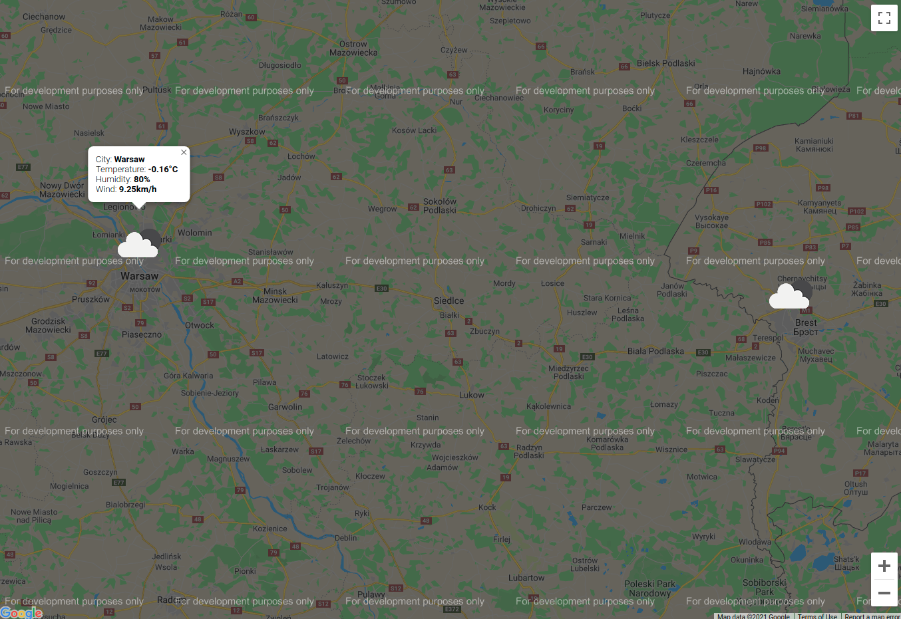

# lab2-weather-map

## Development

To start up nginx web server using docker run:

```bash
docker run -d -p 8000:80 -v ${PWD}/src:/var/html -v ${PWD}/nginx/nginx.conf:/etc/nginx/nginx.conf:ro nginx:latest
```

Then access your browser at `localhost:8000`.

## Demo


